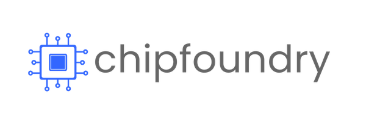

<table>
  <tr>
    <td align="center"></td>
    <td align="center"></td>
    <td align="center"></td>
  </tr>
</table>

# EDABK_SNN_CIM
>This project, submitted to **The NVM Innovation Contest**, introduces a Neurosynaptic Core for hand gesture recognition. The design is based on a hybrid Artificial and Spiking Neural Network architecture and integrates the ReRAM-based NVM IP from BM Labs with the ChipFoundry Caravel SoC Platform. 

## Contributors
All members are affiliated to EDABK Laboratory, School of Electrical and Electronic Engineering, Hanoi University of Science and Technology (HUST).
|No.| Name                                                       | Study programme                          |Relevant link|
|---|------------------------------------------------------------|------------------------------------------|-------------|
|1  | [Phuong-Linh Nguyen](mailto:linh.nguyenphuong1@sis.hust.edu.vn)    | Master of Engineer in IC Design          ||
|2  | [Anh-Dung Hoang](mailto:dung.ha240324e@sis.hust.edu.vn)    | Master of Engineer in IC Design          ||
|3  | [Ngoc-Duong Nguyen](mailto:duong.nn242535m@sis.hust.edu.vn)| Master of Science in IC Design           | |
|4  | [Hoang-Son Nguyen](mailto:son.nh210741@sis.hust.edu.vn)    | Bachelor in Electronics Engineering      | |
|5  | [Viet-Tung Pham](mailto:tung.pv224415@sis.hust.edu.vn)     | Senior student in Electronics Engineering| |
|6  | [Thanh-Hang Vu](mailto:hang.vt233385@sis.hust.edu.vn)      | Junior student in Electronics Engineering| |

## Abstract
The application of hand gesture recognition can be extended to advanced human-machine interaction, enabling touchless control in various domains (e.g., automotive, healthcare). However, deploying such Artificial Intelligence (AI) models on edge devices is often hindered by the latency and power consumption arising from the von Neumann bottleneck, where data must be constantly shuttled between memory and processing units.

From an algorithmic standpoint, Spiking Neural Networks (SNNs) offer a promising solution. Inspired by how the biological brain communicates using discrete neural spikes, SNNs can reduce the quantity and complexity of computations. To compensate for the potential accuracy degradation in pure SNNs, a hybrid approach combining them with Artificial Neural Networks (ANNs) is employed. This allows high-precision input features to be processed, leading to significant accuracy improvements over traditional SNNs.

On the hardware side, implementing large models presents challenges, especially concerning the storage of trainable parameters (e.g., weights, synaptic connections) which would otherwise need to be reloaded into SRAM or flip-flops before each classification. The use of Non-Volatile ReRAM addresses this by preserving the parameters even when the embedded device enters a deep-sleep state. Furthermore, the provided Neuromorphic X1 IP promises in-memory computing capabilities, which minimize the energy and time required for accumulation operations.

Therefore, our team proposes **EDABK_and_any_name_for_the_project**, a solution integrating the ReRAM-based NVM IP from BM Labs and the ChipFoundry Caravel SoC Platform. The overall architecture is described in the [System Block Diagram](#system-block-diagram) section.

## System Block Diagram

The proposed system accepts 13 features as input, corresponding to position, orientation, acceleration, and angular velocity, which are captured by Inertial Measurement Unit (IMU) sensors during human hand movements. Based on this data, the system predicts which gesture class the motion belongs to.

A hardware/software co-design approach is planned for the system implementation. The hardware component, responsible for the primary Neural Network computations, is a Caravel SoC integrated with BM Labs’ NVM IP. The software component, which can run on a host PC or an embedded device, is tasked with encoding sensor data, inferring the final gesture label, and controlling the hardware's operation.

Within the hardware's `user_project_wrapper`, a Controller utilizing a Wishbone Interface manages overall data exchange. The encoded sensor data is first pushed into a Stimuli-in Buffer before being processed by the ReRAM Crossbar array within the BM Labs’ NVM IP. An Address Decoder determines the specific IP commands, thereby selecting the appropriate rows and columns of the array to be accessed. The computational results are then stored in a Spike-out Buffer before being returned to the software component.

## Timeline
- Week 1 (October 13-19):
  + Research and select an optimal Neural Network model for gesture recognition.
  + Architectural design the Neural Accelerator.

- Week 2 (October 20-26):
  + Develop RTL code and perform functional verification for the modules within the Neural Accelerator.
  + Integrate the custom modules with the provided IP and the Caravel Template.

- Week 3 (October 27 - November 2):
  + Conduct system-level simulation and verification, including timing constraints.
  + Resolve any DRC and LVS violations that arise from the tool flow.